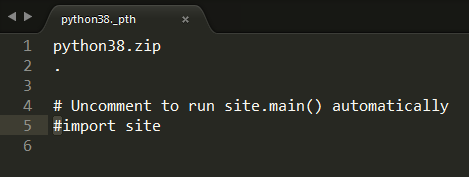

# Python-Embedded开发

### 初衷

找到一种好的方法，将python嵌入到软件中(而不用用户自己安装环境)

(主要是pyinstaller太难用了)

---

### 用法

- 下载 *[python.org](https://www.python.org/downloads/)* 上的 ***python-\*\*\*-embed-amd64.zip*** 文件；
- 解压到 *\\python* 文件夹中；
- 复制 *get-pip.py* 和 *get-pip.bat* 到 *\\python* 下，运行 *get-pip.bat* ；
- 打开 *python\*\*._pth_* ，删掉 "#import site" 中的 "#"，保存；

- 进入 *\\python\\Scripts* ，打开命令行，使用 *pip* 安装 Module；

> 运行时可在 .bat 文件中使用 "python\\python.exe -u \*\*\*.py"

